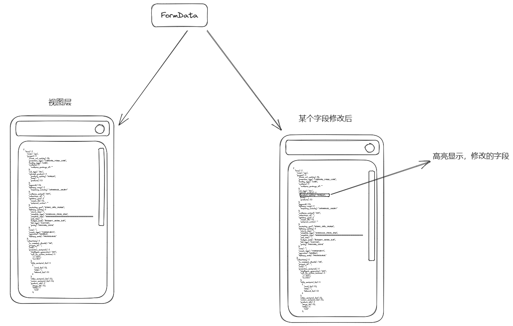

# data-observer
# 表单数据动态监测器


#### 背景
在前端的开发工作中经常会遇到调试表单数据的需求，表单字段一但增加到100多个的大表单时，就会为找视图上面的每个字段的key值而耗费一定的时间和精力，也会经常遇到字段和视图的label错位的情况。
基于上述问题，在开发的时间，我经常会在边上另外写一个浮动的盒子，将一个大表单的数据对象使用 `JSON.stringify`和`<pre>`将数据格式到这个盒子中，以便在观察数据的变化。便于提高开发调试效率。
在不断的使用和优化中，就把这个组件抽离出来，上传的NPM上。

#### 实现思路


#### 展示效果


**开发中用到的技术**

js原生 es6 `Class`封装
`highlight.js` 代码高亮
`MutationObserver` 接口提供了监视对DOM树做更改的能力。
DOM中有节点变化的时候可以监听到，并对监听到新的更改NodeList和旧的NodeList做对比。来找出修改的节点。


#### 如何使用

##### 安装

`npm install star-note`
` yarn add star-note `

##### 使用
在vue3中使用
```javascript
import { useVue3Note } from 'star-note/dist/main.js'
const groupGroupOptions = ref<any>({})
useNote(groupGroupOptions)
```
在原生js环境使用
```javascript
import StarNote from 'star-note/dist/main.js'

const noteApp = new StarNote({y:90})

const data = {a:'1',b:'2'}

// 初始化数据，也是更新数据，可以在事件监听中，不断调用这个函数
noteApp.update(data)


```
 


#### 功能

1. 窗口可以调整大小功能
2. 记忆上次的位置功能
3. 自动滚动到当前使用修改的位置，并标记功能
4. vue3自定义封装hooks函数
5. 增加主题1样式，默认为主题1的样式
6. 增加文字点击复制功能


